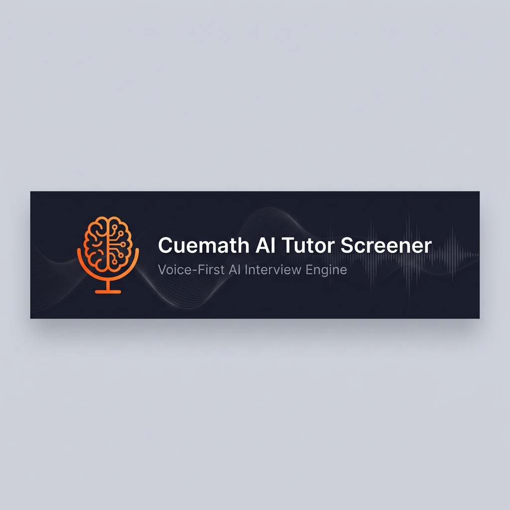

<p align="center">
  
</p>

<p align="center">
  <em>A fully autonomous AI interviewer that screens tutor candidates with human-level empathy — at $0.02 per interview.</em>
</p>

<p align="center">
  <a href="#-the-voice-pipeline"></a>
  <a href="#-tech-stack"></a>
  <a href="docs/DATABASE.md"></a>
  <a href="#-cost-breakdown"></a>
  <a href="LICENSE"></a>
</p>

<p align="center">
  <a href="#-why-this-exists">Why</a> · 
  <a href="#-what-makes-this-different">What's Different</a> · 
  <a href="#-the-voice-pipeline">Voice Pipeline</a> · 
  <a href="#-the-brain-multi-llm-routing">LLM Brain</a> · 
  <a href="#-nisha-the-interviewer">Meet Nisha</a> · 
  <a href="#-assessment-beyond-passfail">Assessment</a> · 
  <a href="#-when-things-break">Resilience</a> · 
  <a href="#-cost-breakdown">Cost</a> · 
  <a href="#-running-locally">Setup</a>
</p>

---

## 🎯 Why This Exists

Cuemath hires thousands of tutors a year. Every single one needs a screening interview — can you explain fractions to a confused 8-year-old? Can you stay patient when a student says "I don't get it" for the third time?

Right now, a human interviewer conducts a 10–15 minute voice call. **₹1,200–2,000 per candidate.** Around 8 per day per interviewer. And the quality? Inconsistent — interviewer fatigue, mood bias, no structured rubric.

I built a system that replaces that entirely. Not with a chatbot. Not with a form. With a voice-first AI interviewer named **Nisha** who conducts a natural, warm conversation — and produces richer data than any human interviewer could.

---

## ⚡ What Makes This Different

Most "AI interview" projects are thin wrappers around ChatGPT with a text box. Here's what I did differently:

**I made it fast.** Most AI voice systems have 1.5–3 second response delays. Mine responds in **200–400ms**. The secret: I don't use OpenAI. I use Groq's LPU hardware running Llama 3.3 70B, and I test provider speed *during mic setup* so the interview starts with the fastest one locked in. Zero overhead during the actual conversation.

**I made it sound human.** I tried adding fake "thinking delays" and filler words ("Mm-hmm", "I see"). It sounded terrible — like a bad chatbot pretending to have emotions. So I deleted all of it and built a deeply specific persona instead. Nisha doesn't say "That's a great answer!" — she says "Oh the pizza thing, nice." Speed IS the humanness.

**I made it free.** ElevenLabs costs $5–99/month for voice. I reverse-engineered Microsoft Edge's neural TTS WebSocket endpoint — **free, unlimited, and 90% as natural**. Then I added SSML prosody so the voice dynamically warms up during encouragement, gets curious during questions, and gentles down for the goodbye.

**I made it survive anything.** The interview never crashes. LLM down? Auto-fallback chain. TTS down? Text on screen. STT down? Text input appears. Tab closed? `sendBeacon` saves everything. All providers fail simultaneously? Pre-written emergency questions for each phase. The candidate always gets a complete interview.

**I made the assessment actually useful.** Not Pass/Fail. Six layers: rubric scores with evidence, speech pattern analytics, integrity analysis (scripted-answer detection), interview quality self-monitoring, coaching tips, and a composite hiring score normalized against the entire candidate pool.

---

## 🎙 The Voice Pipeline

Every exchange follows this path — candidate speaks → text → AI thinks → AI speaks:

```
Candidate speaks into mic (push-to-talk)
    │
    ▼
MediaRecorder captures audio blob (WebM/Opus)
    │
    ▼
POST /api/stt ──► Deepgram Nova-3 ──► Accurate transcript
    │                                   (handles "one-half", "two-thirds",
    │                                    filler words, confidence scores)
    ▼
POST /api/chat ──► Groq (Llama 3.3 70B) ──► AI response text
    │                    │
    │              If Groq fails:
    │              Gemini → OpenRouter → Emergency pre-written responses
    │
    ▼
POST /api/tts ──► Edge TTS + SSML prosody ──► Natural audio
    │              │
    │         Server cache (150 entries, common phrases in <5ms)
    │
    ▼
Candidate hears Nisha respond naturally ← 200-400ms total
```

### Why Push-to-Talk?

I tried auto-silence detection first. It was a nightmare — background noise triggered false positives, thoughtful pauses got interrupted, every mic had different sensitivity. Push-to-talk is infinitely more reliable. No false triggers, no cut-offs, no ambiguity.

### Why Deepgram over Web Speech API?

Web Speech API randomly stops listening, restarts itself, and varies between browsers. During a 10-minute interview, it would silently die 2–3 times. The candidate kept talking. The transcript was empty. Deepgram Nova-3: one API call, one blob, one result. Never fails.

### Why Edge TTS over ElevenLabs?

The SSML is the key differentiator:

```xml
<speak version="1.0" xmlns="http://www.w3.org/2001/10/synthesis">
  <voice name="en-US-JennyNeural">
    <prosody rate="-5%" pitch="+2%">
      Oh, the pizza thing — nice! And then what happens
      when they try to add the slices?
    </prosody>
  </voice>
</speak>
```

The voice dynamically adjusts warmth for encouragement, curiosity for follow-ups, and gentleness for the goodbye. Natural pauses at punctuation prevent the "rushing through sentences" effect.

---

## 🧠 The Brain: Multi-LLM Routing

### The Pre-Flight Speed Test

Most systems health-check APIs on **every request** — that's 200–500ms wasted per exchange. I test all providers **once**, during mic setup, while the candidate is testing their microphone:

```
Mic Setup Screen (candidate adjusting volume)
    │
    ├── Meanwhile, invisible to candidate:
    │
    │   Speed-test Groq ─────► 180ms ✅ (fastest)
    │   Speed-test Gemini ───► 420ms ✅
    │   Speed-test OpenRouter ► 650ms ✅
    │
    │   Lock in: Groq
    │
    ▼
Interview starts. All calls go to Groq. Zero runtime overhead.
```

If Groq dies mid-interview? One fallback attempt → swap to Gemini → swap to OpenRouter → emergency pre-written questions. The candidate never sees a loading spinner longer than 2 seconds.

### Why Groq over OpenAI?

OpenAI takes 1.5–3 seconds per response. In a voice conversation, that silence feels **wrong**. Groq runs Llama 3.3 70B on custom LPU hardware at **200–400ms**. The candidate barely finishes talking before Nisha responds. That speed is what makes it feel like a real conversation, not a bot interaction.

Free tier: 14,400 requests/day. More than enough.

---

## 👩‍🏫 Nisha: The Interviewer

Nisha isn't a generic chatbot. She has a deeply crafted persona with explicit rules:

**Things Nisha NEVER says** (because they instantly reveal AI):
- "That's a great answer!"
- "Could you elaborate on that?"
- "Thank you for sharing"
- "That's very insightful"

**Things Nisha DOES say:**
- "Oh the pizza thing, nice."
- "Yeah? And then what?"
- "Hmm, what if they still don't get it though?"

**The Five Phases:**

| # | Phase | What Nisha Does | What Gets Scored |
|---|---|---|---|
| 1 | **Warm-up** | Casual intro, teaching background | Communication, warmth |
| 2 | **Teaching Scenario** | "A student says 1/2 + 1/3 = 2/5. What do you do?" | Simplification, pedagogy |
| 3 | **Patience Probe** | Simulates confused student: "But WHY can't I just add them?" | Patience, empathy |
| 4 | **Adaptability** | Curveball: "What if they start crying?" | Quick thinking, EQ |
| 5 | **Wrap-up** | "Any questions about the role?" Natural goodbye. | Professionalism |

**When candidates get stuck:** A real interviewer says "No worries, let's move on." So does Nisha. She never forces an answer. A candidate who says "I don't know" is showing self-awareness — the assessment notes this positively.

---

## 📊 Assessment: Beyond Pass/Fail

A "Pass/Fail" verdict is useless for hiring decisions. The assessment engine produces **six layers**:

### Layer 1 — Rubric Evaluation *(Gemini)*
Five dimensions scored 1–5 with qualitative evidence:

| Dimension | Weight | What It Measures |
|---|---|---|
| Communication Clarity | 25% | Can they explain clearly? |
| Warmth & Rapport | 20% | Do they create a safe learning space? |
| Simplification Ability | 25% | Can they break down complex concepts? |
| Patience Indicators | 20% | How do they handle repeated confusion? |
| English Fluency | 10% | Natural communication flow |

**Score validation:** The server independently recalculates the weighted score and **overrides Gemini** if the math doesn't match. Recommendations are derived from rules, not LLM judgment:
- **Strong Pass:** overall ≥ 4.0 and no dimension below 3.5
- **Pass:** overall ≥ 3.5 and no dimension below 2.5
- **Borderline:** doesn't qualify for pass or fail
- **Fail:** 2+ dimensions below 2.5, overall < 3.0, or red flags present

### Layer 2 — Speech Analytics *(Zero-LLM, pure computation)*
- Response latency (time between question and answer)
- Hedging frequency ("um", "kind of", "I think maybe")
- Analogy usage ("it's like...", "think of it as...")
- Vocabulary richness (unique word ratio)

### Layer 3 — Integrity Analysis *(Groq)*
Detects scripted/rehearsed answers, engagement drops, and suspicious response patterns.

### Layer 4 — Interview Quality *(Self-monitoring)*
The system evaluates **its own questions**: Were they effective? Was the difficulty appropriate?

### Layer 5 — Coaching Feedback *(Gemini)*
Actionable, encouraging tips: "Your patience was excellent. Try using more concrete examples."

### Layer 6 — Composite Hiring Score
A single **0–100 metric** weighing all signals, adjusting for interview difficulty, normalized against the historical candidate pool.

---

## 💥 When Things Break

The cardinal rule: **the interview never crashes visibly.** If everything behind the scenes is on fire, the candidate sees a functioning interview that gracefully concludes.

| What Fails | What Happens Internally | What the Candidate Sees |
|---|---|---|
| LLM dies | Groq → Gemini → OpenRouter → pre-written questions | Nisha keeps talking naturally |
| TTS fails | Edge TTS → Web Speech API → text display | Response appears as text |
| STT fails | After 3 errors → text input appears | "Type your answer instead" |
| Network drops | Yellow banner + state saved | Brief pause, seamless resume |
| Tab closes | `sendBeacon` saves everything | "Resume where you left off?" on reopen |
| All providers fail | Emergency phase-aware scripted questions | Slightly less dynamic, still functional |
| 15-min timeout | Nisha wraps up gracefully | Natural goodbye |

---

## 💰 Cost Breakdown

| Component | Provider | Cost/Interview | Why This Provider |
|---|---|---|---|
| Speech-to-Text | Deepgram Nova-3 | ~$0.015 | Commercial-grade, $200 free credit |
| LLM (Conversation) | Groq (Llama 3.3 70B) | $0.00 | 200ms responses, 14,400 req/day free |
| LLM (Assessment) | Gemini 2.0 Flash | $0.00 | Structured JSON output, free tier |
| Text-to-Speech | Edge TTS | $0.00 | Neural voices, unlimited, SSML support |
| Database | Supabase | $0.00 | PostgreSQL, 500MB free tier |
| Hosting | Vercel | $0.00 | Edge functions, global CDN |
| **Total** | | **~$0.02** | **vs. ₹1,500 human interviewer** |

---

## 🏗 Tech Stack

```
Frontend:     Next.js 16 (App Router) · React 19 · TypeScript · Tailwind CSS · Framer Motion · GSAP
AI:           Groq (Llama 3.3 70B) · Google Gemini 2.0 Flash · OpenRouter (fallback)
Voice:        Deepgram Nova-3 (STT) · Edge TTS reverse-engineered WSS (TTS)
Database:     Supabase (PostgreSQL)
Email:        Resend
Hosting:      Vercel (serverless)
```

---

## 🗂 Project Structure

```
src/
├── app/
│   ├── page.tsx                    # Landing page (GSAP scroll effects)
│   ├── interview/[token]/          # Candidate interview room
│   ├── practice/                   # Practice mode (no data saved)
│   └── admin/
│       ├── page.tsx                # Dashboard with auto-refresh
│       ├── [id]/                   # Deep-dive: transcript + assessment
│       ├── compare/                # Side-by-side candidate comparison
│       ├── analytics/              # Aggregate hiring analytics
│       ├── insights/               # AI-generated strategic insights
│       └── monitoring/             # System health & latency metrics
├── components/
│   ├── InterviewRoom.tsx           # Core interview UI & state machine
│   ├── AudioVisualizer.tsx         # Real-time audio waveform (Web Audio API)
│   ├── AssessmentView.tsx          # Rubric display with dimension cards
│   ├── DeepIntelligenceView.tsx    # Speech analytics & integrity report
│   └── HiringScoreWidget.tsx       # Composite score gauge
└── lib/
    ├── llm.ts                      # Multi-provider LLM router
    ├── edge-tts-client.ts          # Edge TTS reverse-engineered WSS client
    ├── ssml.ts                     # Dynamic SSML prosody generation
    ├── interview-engine.ts         # Phase progression & system prompts
    ├── scoring-engine.ts           # Composite hiring score algorithm
    ├── speech-analytics.ts         # Response latency, hedging, analogies
    ├── integrity-analysis.ts       # Scripted-answer detection (Groq)
    ├── rate-limiter.ts             # Per-IP sliding window rate limiter
    └── sanitize.ts                 # XSS prevention & input validation
```

---

## 🔒 Security

Not an afterthought. Built into every layer:

- **Zero client-side secrets** — All API keys server-only. None prefixed with `NEXT_PUBLIC_`. None in the browser bundle. None in network requests.
- **Rate limiting everywhere** — 30 LLM req/min, 100 TTS req/min, 5 login attempts/15 min. Per-IP sliding window.
- **Input sanitization** — Every user-provided string goes through `sanitize.ts`: XSS stripping, max-length enforcement, email validation.
- **Auth hardening** — `httpOnly`, `secure`, `sameSite: strict` cookies. Timing-safe password comparison.
- **Security headers** — HSTS, X-Frame-Options DENY, X-Content-Type-Options nosniff, Permissions-Policy.
- **Generic errors** — Internal errors logged server-side, never sent to clients.
- **Crypto tokens** — `crypto.randomUUID()` interview tokens with 7-day expiry.

---

## 🚀 Running Locally

```bash
git clone https://github.com/TanishqKatiyar/cuemath-ai-screener.git
cd cuemath-ai-screener
npm install
cp .env.example .env.local   # Fill in your API keys
npm run dev                   # http://localhost:3000
```

You'll need: [Groq](https://console.groq.com) + [Google AI Studio](https://aistudio.google.com) + [Deepgram](https://deepgram.com) + [Supabase](https://supabase.com) (all free tiers).

See [`.env.example`](.env.example) for the full list of variables and [`docs/DATABASE.md`](docs/DATABASE.md) for schema setup.

---

## 📚 Deep Dives

| Document | What's Inside |
|---|---|
| [`ARCHITECTURE.md`](docs/ARCHITECTURE.md) | Component-by-component technical walkthrough |
| [`DATABASE.md`](docs/DATABASE.md) | Supabase schema, JSON structures, indexes |
| [`PROCESS.md`](docs/PROCESS.md) | What I tried first, what broke, what I changed |
| [`CHANGELOG.md`](CHANGELOG.md) | Structured v1.0.0 feature changelog |

---

## 🔮 What I'd Build Next

1. **Real-time streaming STT** — Live transcript as the candidate speaks (Deepgram WebSocket)
2. **Voice cloning** — A unique, consistent voice for Nisha (ElevenLabs/Cartesia)
3. **Hindi-English code-switching** — Deepgram supports 30+ languages, Cuemath operates in India
4. **A/B question testing** — Automated rotation to optimize signal quality
5. **Fine-tuned evaluation model** — Trained on human-scored transcripts for tighter correlation with outcomes

---

<p align="center">
  <strong>Built for Cuemath.</strong>
  <br /><br />
  Every technical decision — the voice pipeline, the LLM routing, the assessment layers, the resilience chain — optimizes for one thing:<br />
  giving candidates a fair, comfortable interview and giving hiring managers the data to make confident decisions.
</p>
